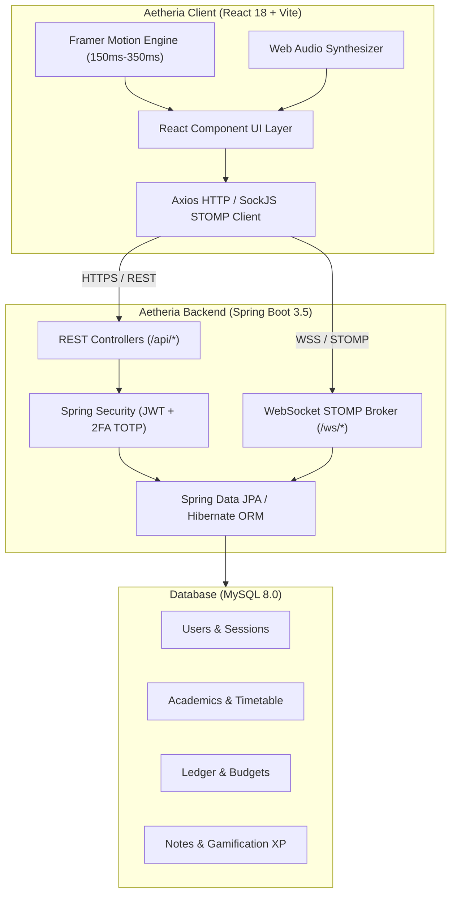

# 🏛️ Aetheria System Architecture

Aetheria is an all-in-one gamified SaaS productivity operating platform structured around a modern decoupled client-server architecture.

---

## 🔒 Security Architecture
1. **JWT Session Tokens**: Signed with HMAC SHA-256 keys, stored in secure local storage with expiration validation.
2. **Two-Factor Authentication (2FA)**: Time-based One-Time Passwords (TOTP) generated via authenticator applications.
3. **Password Security**: Hashed via BCrypt with salt rounds.
4. **CORS Policy**: Configured in `CorsConfig.java` to support credentialed cross-origin requests.

---

## 📡 WebSockets & Real-Time Notification Pipeline
- Connection: STOMP protocol over SockJS fallback endpoint `/ws`.
- Channels:
  - `/topic/notifications`: System-wide achievements, level-up alerts, and budget threshold warnings.
